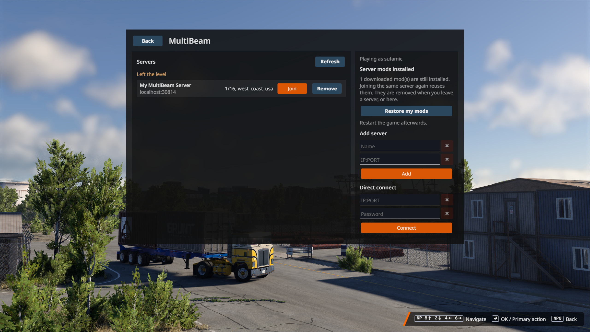

# MultiBeam

Multiplayer for BeamNG.drive 0.39. Run a server, install the mod, join with an IP and port from the in-game menu. No launcher, no account, no chat. Your Steam name is your name.

There are three folders. Server is for whoever hosts, Client is for everyone, Bridge is only for people joining a server that isn't on their own PC.

Special thanks to [SADxHIPPO](https://github.com/SADxHIPPO) for testing over and over and over.
Join the [MultiBeam Discord](https://discord.gg/rbNumJPmqE) for troubleshooting, testing, and more!!

NOTE: Most code is generated with Claude Code alongside human testing. This is due to my lack of technical knowledge about C# & Lua. Just here to have fun with Beam.NG :) 

## Host a server

1. Copy the `Server` folder somewhere.
2. Run `Run Server.bat`. It builds the server and starts it. A `config.yml` is created the first time.
3. Edit `config.yml` (options below), close the server and run the bat again.
4. If people are joining over the internet, forward TCP port 30814 to this PC.

Console commands: `list`, `kick <name>`, `stop`.

## Install the mod

1. Close BeamNG.
2. Copy the `Client` folder somewhere and run `Build Mod.bat`. It puts `multibeam.zip` in your BeamNG mods folder.
3. Start the game.

Do not run the bat while the game is open. It builds the zip but won't install it, and replacing the zip under a running game breaks the mod until you restart.

## Join

Server on your own PC:

1. In the game go to Main menu, More, MultiBeam.
2. Add `localhost:30814` and press Join.

Server on another PC (you need the bridge, because BeamNG only lets mods connect to your own PC):

1. Open `Bridge/config.yml` and set `server:` to the server's `IP:PORT`.
2. Windows: run `Run Bridge.bat`. Linux: run `bash run-bridge.sh` (needs Python 3).
3. In the game add `127.0.0.1:30800` (the `listen` port from the config) and press Join.

Leave the bridge window open while you play.

## config.yml

| Key | Default | What it does |
| --- | --- | --- |
| name | MultiBeam Server | shown in the server list |
| port | 30814 | TCP port |
| maxplayers | 16 | player limit |
| maxvehicles | 4 | vehicles per player |
| map | gridmap_v2 | level folder name, like west_coast_usa |
| password | empty | leave empty for public |
| motd | Welcome to MultiBeam! | message on join |
| requiresteam | true | players must be on Steam (needed for saved progress) |
| career | false | run everyone in career mode, saves kept on the server |
| traffic | true | career only, shared AI traffic |
| trafficamount | 6 | career only, moving AI cars in the world |
| parkedamount | 4 | career only, parked AI cars in the world |
| modsync | true | force players to run exactly the mods in the `mods` folder |

Player progress (position, vehicles, damage) and career saves are stored in `Server/players`, one file per Steam ID.

## Career mode

1. Set `career: true` and `map:` to a map with career content (west_coast_usa works).
2. Restart the server.

Each player runs the game's own career on the server's map. The save lives on the server and is uploaded after every game save, so it follows the player between PCs. AI traffic is split between players (the totals are `trafficamount` and `parkedamount`). You can't enter another player's AI car, except taxis.

## Server mods

1. Put the `.zip` mods you want everyone to run in `Server/mods`.
2. Restart the server.

When a player joins, the game shows what will change. They download the mods they don't have, their other mods get switched off, and then they join. When they leave on purpose the downloaded mods are deleted and their own mods come back. Losing the connection doesn't remove anything, so rejoining is quick. Nobody can join with more or fewer mods than the server has. Set `modsync: false` to turn all of this off.

If a mod contains game code (the RLS Career Overhaul is one), the game has to be restarted after the download. It then rejoins the server by itself. If you put RLS on a server you need your own copy of it.

## Problems

- "connect restricted" or "needs bridge": use the bridge (see Join).
- "Version mismatch": update the server and the mod, then restart the game.
- Menu is blank or the mod does nothing: the zip was replaced while the game was running. Close the game, run `Build Mod.bat`, start the game.
- Dropped while a big level loads: restart the server on the latest build.
- Logs: `%LOCALAPPDATA%\BeamNG\BeamNG.drive\current\beamng.log`, search for `multibeam`. The server logs in its own window.

## Credits

The vehicle sync modules (`mbPositionVE`, `mbVelocityVE`, `mbInputsVE`, `mbElectricsVE`, `mbPowertrainVE`, `mbNodesVE`) are adapted from [BeamMP](https://github.com/BeamMP/BeamMP), which is AGPL-3.0-or-later. Those files keep that license. Not affiliated with BeamNG or BeamMP.

## License

IDGAF. Do whatever you want with it. No warranty, don't blame me if it breaks your game. The BeamMP files above are the one exception, they stay AGPL.
